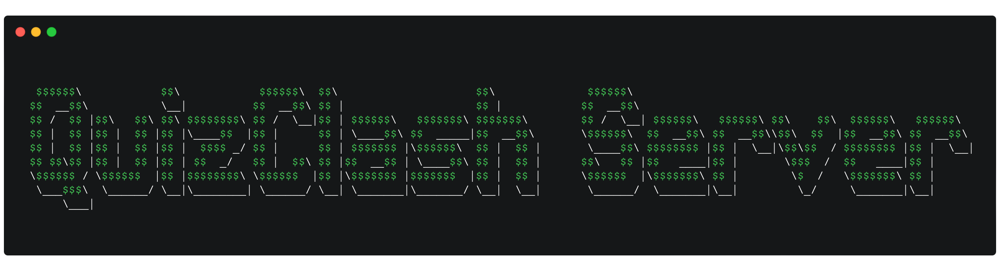

The QuizClash Server is a dedicated project designed to complement the 
[QuizClash](https://github.com/4KevR/quiz-clash/tree/main) CLI game. This project introduces server-side WebSocket 
functionalities to the existing Java CLI-client, extending the game's features to enable engaging online multiplayer
gameplay.

## Setup

### Prerequisites

- Docker

### Run the Server

Follow these steps to set up the QuizClash Server:

1. Create a fresh `.env` file, taking cues from the provided `.env.example` file, and customize it to match your 
   desired configuration settings.
2. Invoke the server using the command below:

```bash
docker-compose up --build -d
```

> [!NOTE]
> The included *docker-compose.yml* file is particularly configured for local development.

Once your server is live and accessible, you need to perform a one-time setup of the database to initialize the 
category repository. This step requires a categories.json file in the same format as 
[here](https://github.com/4KevR/quiz-clash/blob/main/plugin-database/src/main/resources/categories.json). 
Use the commands below to implement this:

```bash
docker cp categories.json quiz-clash:/flask-app/categories.json
docker exec -it quiz-clash bash
python setup.py
```

With the setup phase completed, you can disconnect from the container and start connecting with your clients 
at http://localhost:7000.

Get ready to experience an amplified, exciting QuizClash gameplay!
